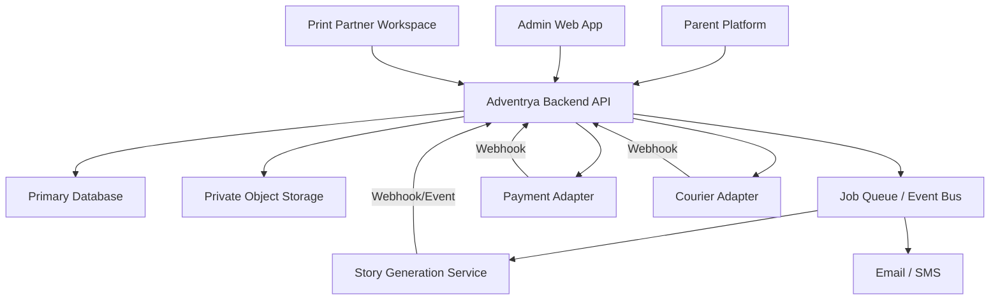

# 02 - Recommended Architecture

## System boundary

## Recommended application split

### Customer web application

Owns:

- child profiles;
- book setup and Preview;
- authentication;
- checkout;
- reader and downloads;
- parent dashboard.

### Admin web application

Owns:

- operations and support interfaces;
- print approval;
- generation monitoring;
- Print Partner and courier workflow;
- promotion management;
- roles and audit visibility.

### Backend API

Owns:

- authorization;
- validation;
- transactional state changes;
- database persistence;
- file access;
- provider adapters;
- webhook verification;
- idempotency;
- audit events;
- notifications.

## Integration rule

The browser must never contain provider credentials or enforce the final
business rule by itself. The Admin sends an authenticated intent to the API; the
API checks role, current state, unique constraints, and idempotency before
performing the action.

## Suggested deployment environments

| Environment | Purpose |
| --- | --- |
| Local | Mock/test provider development |
| Staging | Real integrations in sandbox/test mode |
| Production | Live orders and real customer data |

Use separate databases, object-storage buckets, webhook secrets, and provider
accounts for each environment.

## Recommended event pattern

Write the business record and an outbox event in one database transaction.
Background workers publish/process outbox events. This prevents a paid order,
approved PDF, or courier creation from being saved without its required
downstream action.

Example events:

- `payment.succeeded`
- `order.activated`
- `generation.started`
- `generation.completed`
- `generation.failed`
- `print_asset.approved`
- `print_job.assigned`
- `print_job.status_changed`
- `courier_shipment.created`
- `courier_shipment.status_changed`
- `delivery.completed`

